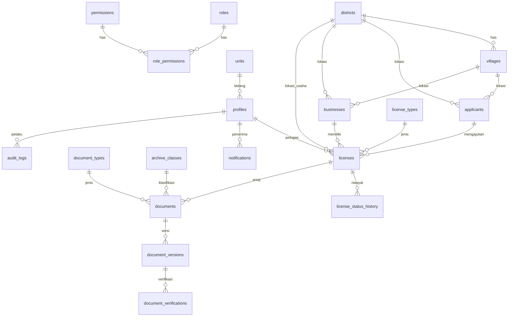

# SIPAR-BELU — Paket Desain (Pra-Implementasi)

Sistem Informasi Pengarsipan dan Manajemen Dokumen Perizinan Kabupaten Belu
DPMPTSP Kabupaten Belu · Draft desain v1 · 6 Oktober 2026

Dokumen ini disusun sebelum coding sesuai instruksi. Implementasi dimulai dari PHASE 1 setelah desain disetujui.

---

## 0. Analisis Kebutuhan Singkat dan Asumsi

Aplikasi adalah DMS perizinan: data induk (pemohon, perusahaan, izin) + arsip dokumen berversi + verifikasi + workflow status + audit + pencarian + QR publik + laporan.

Bagian prompt yang belum rinci, dan asumsi aman yang saya ambil:

| # | Hal | Asumsi |
|---|-----|--------|
| A1 | Pengelolaan role | Role disimpan sebagai enum `app_role` di `profiles.role` (sumber kebenaran untuk RLS). Tabel `roles`, `permissions`, `role_permissions` tetap dibuat untuk matriks izin yang dapat dibaca UI dan dikelola Super Admin, tetapi RLS memakai fungsi `has_role()` agar cepat dan sederhana. |
| A2 | Pembuatan user | Hanya Super Admin. Dilakukan lewat Supabase Edge Function `admin-create-user` (memakai service role di sisi server, tidak pernah di frontend). Tidak ada pendaftaran mandiri. |
| A3 | Halaman publik QR | Fungsi RPC `verify_license(code)` bertipe `SECURITY DEFINER` yang hanya mengembalikan kolom aman. Anon tidak punya akses SELECT ke tabel apa pun. Nama pemegang izin tampil penuh, NIK/NPWP tidak pernah tampil. |
| A4 | Hapus data | Soft delete (`deleted_at`) untuk licenses, applicants, businesses, documents. Hard delete hanya untuk Super Admin lewat fungsi khusus dan tercatat di audit. |
| A5 | Kepemilikan dokumen | Dokumen selalu menempel pada satu izin (`license_id`). Pemilik = pemohon/perusahaan dari izin itu. |
| A6 | Dokumen belum lengkap | Dihitung dari `document_types.required_for_license_type` terhadap dokumen berstatus bukan "belum ada". Tidak butuh tabel baru. |
| A7 | Ukuran file | Batas 10 MB per file, tipe PDF/JPG/JPEG/PNG. Divalidasi di frontend, di bucket (`file_size_limit`, `allowed_mime_types`), dan di tabel (CHECK). |
| A8 | Izin berakhir otomatis | Job harian `pg_cron` mengubah status AKTIF menjadi BERAKHIR bila `expiry_date` lewat, membuat notifikasi "akan berakhir" 30 hari sebelumnya. |
| A9 | Pencarian | `pg_trgm` + indeks GIN pada kolom kunci, ditambah view `v_license_search` agar satu query mencakup izin, pemohon, perusahaan. |
| A10 | Export | Excel/CSV di sisi klien (library xlsx) dari data yang sudah lolos RLS. PDF memakai halaman cetak browser (opsional library jsPDF). |
| A11 | Hosting | Vercel sebagai static SPA (Vite build). Tidak ada serverless function di Vercel. Seluruh logika server ada di Supabase. |
| A12 | Email lupa password | Memakai email reset bawaan Supabase Auth. Redirect URL harus didaftarkan di Supabase setelah domain Vercel diketahui. |

---

## 1. Arsitektur Aplikasi

```
 Pegawai / Publik (browser)
          │  HTTPS
          ▼
 ┌──────────────────────────────┐
 │ Vercel (CDN, static SPA)     │  React + TS + Vite + Tailwind + shadcn/ui
 │  /dist  + vercel.json rewrite│  React Router, TanStack Query, Zod
 └──────────────┬───────────────┘
                │ supabase-js (anon key + JWT user)
                ▼
 ┌─────────────────────────────────────────────────────────┐
 │ Supabase                                                │
 │  Auth ── JWT ──► PostgREST ──► PostgreSQL (RLS aktif)   │
 │                                 ├ tabel + trigger audit  │
 │                                 ├ fungsi has_role()      │
 │                                 ├ RPC verify_license()   │
 │                                 └ pg_cron (izin berakhir)│
 │  Storage: bucket privat perizinan-documents (policy)    │
 │  Edge Function: admin-create-user (service role, server)│
 └─────────────────────────────────────────────────────────┘
```

Prinsip:

1. Keamanan di database (RLS + storage policy), bukan di frontend. Frontend hanya menyembunyikan menu demi kenyamanan.
2. Satu-satunya kunci di frontend adalah anon key. Service role hanya ada di Edge Function (secret Supabase).
3. File tidak masuk PostgreSQL. DB menyimpan metadata + `storage_path`. Preview dan download memakai signed URL berumur pendek (60 detik).
4. Perubahan penting (status izin, upload, verifikasi, hapus) dicatat otomatis oleh trigger ke `audit_logs`, jadi tidak bisa terlewat oleh bug frontend.

Lapisan frontend: `pages` (layar) → `components` (UI reusable) → `hooks` (TanStack Query) → `services` (satu file per modul yang memanggil Supabase) → `lib/supabase.ts`. Tipe database dihasilkan dari skema (`types/database.ts`).

---

## 2. ERD



Relasi inti sesuai prompt: `applicants → licenses → documents → document_versions → document_verifications`. Perusahaan (`businesses`) juga dapat memiliki banyak izin; sebuah izin memiliki pemohon (wajib) dan perusahaan (opsional, untuk izin perorangan).

---

## 3. Struktur Database

Semua PK `uuid default gen_random_uuid()`. Semua tabel relevan punya `created_at`, `updated_at` (trigger `set_updated_at`). Tabel utama punya `deleted_at` (soft delete).

**Enum:**
`app_role` = super_admin, admin_arsip, petugas, verifikator, pimpinan, viewer
`license_status` = DRAFT, DIAJUKAN, VERIFIKASI, DISETUJUI, DITERBITKAN, AKTIF, BERAKHIR, DITOLAK, DICABUT, DIBATALKAN
`doc_status` = MENUNGGU_VERIFIKASI, TERVERIFIKASI, DITOLAK (status "Belum ada" = tidak ada baris dokumen untuk jenis wajib tersebut)
`verification_result` = TERVERIFIKASI, DITOLAK

**Akses & organisasi**
- `profiles` — id (= auth.users.id), full_name, nip, phone, role `app_role`, unit_id, is_active, created_at, updated_at
- `roles` — code, label, description
- `permissions` — code (mis. `license.create`, `document.verify`), module, label
- `role_permissions` — role_code, permission_code (PK gabungan)
- `units` — id, name (Unit/Bidang)

**Wilayah**
- `districts` — id, code, name
- `villages` — id, district_id, code, name, type (desa/kelurahan)

**Pihak**
- `applicants` — id, full_name, nik (unik), npwp, phone, email, address, district_id, village_id, created_by, deleted_at
- `businesses` — id, name, nib (unik), npwp, entity_type, address, district_id, village_id, phone, email, person_in_charge, created_by, deleted_at

**Perizinan**
- `license_types` — id, code (unik), name, category, description, validity_months (null = tanpa batas), is_active
- `licenses` — id, license_number (unik, null saat DRAFT), application_number (unik), nib, license_type_id, applicant_id, business_id, district_id, application_date, issue_date, expiry_date, status `license_status`, officer_id, verification_code (unik, acak 12 karakter, dibuat otomatis), year (generated dari tanggal), notes, created_by, deleted_at
- `license_status_history` — id, license_id, from_status, to_status, note, changed_by, changed_at

**Arsip & DMS**
- `document_types` — id, code, name, storage_folder (ktp, nib, npwp, surat-permohonan, surat-izin, dokumen-pendukung), is_required, is_active
- `archive_classes` — id, code, name (Klasifikasi Arsip)
- `documents` — id, license_id, document_type_id, archive_class_id, document_number, document_date, title, status `doc_status`, current_version_id, created_by, deleted_at
- `document_versions` — id, document_id, version_no, file_name, storage_path (unik), mime_type, size_bytes, checksum_sha256, is_current, uploaded_by, uploaded_at. Baris tidak pernah di-UPDATE kecuali flag `is_current`; tidak pernah dihapus.
- `document_verifications` — id, document_version_id, result `verification_result`, note (wajib bila DITOLAK, CHECK), verified_by, verified_at

**Sistem**
- `notifications` — id, user_id, type, title, body, link, is_read, created_at
- `audit_logs` — id (bigint), user_id, user_name, action, module, record_id, old_value jsonb, new_value jsonb, ip_address, user_agent, created_at. Append-only: tidak ada policy UPDATE/DELETE untuk siapa pun, `REVOKE UPDATE, DELETE` dari role authenticated.
- `system_settings` — key, value jsonb (nama instansi, batas ukuran file, hari peringatan berakhir)

**Indeks utama:** B-tree pada `licenses(license_number)`, `(status)`, `(year)`, `(license_type_id)`, `(district_id)`, `(expiry_date)`, `(verification_code)`; `documents(license_id)`, `(status)`; FK semua diindeks. GIN trigram pada `applicants.full_name`, `applicants.nik`, `businesses.name`, `businesses.nib`, `licenses.application_number`, `documents.document_number`.

---

## 4. Struktur Folder

```
sipar-belu/
├── docs/                      # dokumen desain, panduan deploy
├── supabase/
│   ├── migrations/            # 0001_schema.sql, 0002_rls.sql, 0003_functions_triggers.sql, 0004_storage.sql
│   ├── functions/admin-create-user/
│   └── seed.sql
├── public/
├── src/
│   ├── components/
│   │   ├── ui/                # shadcn/ui
│   │   └── shared/            # DataTable, StatusBadge, ConfirmDialog, EmptyState, FileDropzone
│   ├── layouts/               # AppLayout (sidebar+topbar), AuthLayout, PublicLayout
│   ├── pages/
│   │   ├── auth/  dashboard/  licenses/  applicants/  businesses/
│   │   ├── documents/  search/  reports/  notifications/
│   │   ├── users/  master/  audit/  settings/  verify/
│   ├── hooks/                 # useAuth, usePermission, useDebounce, query hooks per modul
│   ├── lib/                   # supabase.ts, queryClient.ts, utils.ts
│   ├── services/              # licenses.ts, documents.ts, storage.ts, reports.ts, ...
│   ├── types/                 # database.ts (generated), domain.ts
│   ├── utils/                 # format tanggal id-ID, sanitasi nama file, export excel/csv
│   └── routes/                # router.tsx, ProtectedRoute, RoleGuard
├── .env.example               # VITE_SUPABASE_URL, VITE_SUPABASE_ANON_KEY
├── vercel.json                # rewrite SPA + header keamanan
├── package.json  tsconfig.json  vite.config.ts  tailwind.config.ts
```

---

## 5. Role dan Permission Matrix

Legenda: C=buat, R=lihat, U=ubah, D=hapus (soft), V=verifikasi, — = tidak ada akses.

| Modul | Super Admin | Admin Arsip | Petugas | Verifikator | Pimpinan | Viewer |
|-------|:-:|:-:|:-:|:-:|:-:|:-:|
| Dashboard & statistik | R | R | R | R | R | R (terbatas) |
| Perizinan | CRUD | CRU | CRU (milik sendiri/ditugaskan) | R | R | R |
| Ubah status izin | semua | draft→diajukan, terbitkan | draft→diajukan | verifikasi→disetujui/ditolak | — | — |
| Pemohon & perusahaan | CRUD | CRU | CRU | R | R | R |
| Dokumen (upload/versi) | CRUD | CRUD | CRU | R | R | R |
| Hapus dokumen (soft) | ✔ | ✔ | — | — | — | — |
| Verifikasi dokumen | ✔ | — | — | V | — | — |
| Lihat riwayat versi | ✔ | ✔ | ✔ | ✔ | ✔ | ✔ |
| Pencarian arsip | ✔ | ✔ | ✔ | ✔ | ✔ | ✔ |
| Laporan & export | ✔ | ✔ | R | R | ✔ | — |
| Notifikasi (milik sendiri) | ✔ | ✔ | ✔ | ✔ | ✔ | ✔ |
| Master data (jenis izin/dokumen, wilayah, klasifikasi, unit) | CRUD | R | R | R | R | R |
| Manajemen user & role | CRUD | — | — | — | — | — |
| Audit log | R | R | — | — | R | — |
| Pengaturan sistem | CRUD | — | — | — | — | — |

Catatan asumsi: "Viewer hanya data yang diberikan akses" diwujudkan sebagai read-only seluruh data izin berstatus AKTIF/BERAKHIR/DITERBITKAN (bukan draft/proses), tanpa NIK/NPWP penuh pada tampilan. Pemberian akses per-izin yang lebih granular dapat ditambahkan lewat tabel `license_access` bila instansi membutuhkannya (di luar lingkup awal).

---

## 6. Strategi RLS

**Prinsip:** RLS aktif di semua tabel, `FORCE ROW LEVEL SECURITY` pada tabel sensitif, default tolak. Role `anon` tidak punya policy di tabel mana pun.

**Fungsi bantu** (`SECURITY DEFINER`, `STABLE`, `search_path = public`):
- `current_role_code()` → membaca `profiles.role` untuk `auth.uid()` dan hanya jika `is_active`
- `has_role(variadic text[])` → true bila role aktif termasuk dalam daftar
- `can_write_archive()` → super_admin, admin_arsip, petugas

**Pola policy:**

| Tabel | SELECT | INSERT | UPDATE | DELETE |
|-------|--------|--------|--------|--------|
| profiles | diri sendiri; semua role internal boleh baca nama (untuk tampil "petugas") tanpa kolom sensitif lewat view; super_admin semua | hanya via Edge Function | diri sendiri (nama/telepon saja, role tidak bisa); super_admin semua | tidak ada (nonaktifkan, bukan hapus) |
| master (license_types, document_types, districts, villages, archive_classes, units) | semua authenticated | super_admin | super_admin | super_admin |
| applicants, businesses | semua role internal (viewer lewat view tersamar) | super_admin, admin_arsip, petugas | sama | super_admin (soft) |
| licenses | internal: semua yang `deleted_at is null`; viewer: hanya status publik | super_admin, admin_arsip, petugas | admin/super_admin semua; petugas hanya `officer_id = auth.uid()` dan status DRAFT/DIAJUKAN; verifikator hanya kolom status via fungsi | super_admin (soft) |
| documents, document_versions | sama seperti licenses (mengikuti izin induk) | can_write_archive | hanya flag `is_current`, tidak ada ubah file | tidak ada hard delete; soft delete admin |
| document_verifications | internal baca | **hanya lewat `verify_document()`** (verifikator, super_admin; `verified_by` = auth.uid()) | tidak ada | tidak ada |
| license_status_history | internal baca | hanya lewat trigger | tidak ada | tidak ada |
| notifications | `user_id = auth.uid()` | trigger/fungsi | pemilik (is_read) | pemilik |
| audit_logs | super_admin, admin_arsip, pimpinan | hanya trigger | tidak ada | tidak ada |
| system_settings | internal baca | super_admin | super_admin | super_admin |

**Transisi status** dipaksa di database lewat fungsi `change_license_status(license_id, new_status, note)` (SECURITY DEFINER) yang memeriksa role dan urutan yang sah (matriks transisi di bagian 7), menulis `license_status_history`, dan memicu audit. Update langsung ke kolom `status` ditolak oleh policy/trigger. Dengan begitu verifikator tidak bisa mengubah data izin lain dan petugas tidak bisa melompati verifikasi.

**Storage** (bucket `perizinan-documents`, privat, `file_size_limit` 10 MB, `allowed_mime_types` pdf/jpeg/png):
- SELECT: semua role internal (viewer hanya bila izin induk berstatus publik; dicek lewat fungsi yang mencocokkan `license_id` dari segmen path ke-2)
- INSERT: `can_write_archive()` dan path harus berpola `{tahun}/{license_id}/{folder}/{uuid}-{namaAman}`
- UPDATE/DELETE: tidak diizinkan untuk authenticated (versi lama tidak pernah dihapus). Penghapusan fisik hanya prosedur khusus Super Admin di dashboard Supabase.
- Download selalu lewat `createSignedUrl(path, 60)`.

**Halaman publik:** `verify_license(code text)` mengembalikan satu baris: nomor izin, jenis izin, nama pemegang (perusahaan atau pemohon), tanggal terbit, status, nama instansi. Tidak ada kolom lain. Di-GRANT EXECUTE ke `anon`. Kode verifikasi acak 12 karakter (tidak berurutan, tidak bisa ditebak) dan dibatasi pada status DITERBITKAN/AKTIF/BERAKHIR/DICABUT.

**Pengujian RLS (PHASE 7):** skrip SQL yang menjalankan `set local role authenticated` + `request.jwt.claims` untuk tiap role dan memverifikasi hasil SELECT/INSERT/UPDATE/DELETE per tabel terhadap matriks di atas.

---

## 7. Workflow Perizinan

```
DRAFT → DIAJUKAN → VERIFIKASI → DISETUJUI → DITERBITKAN → AKTIF → BERAKHIR
                        │            │
                        ▼            ▼
                     DITOLAK     DIBATALKAN        AKTIF/DITERBITKAN → DICABUT
```

| Dari | Ke | Siapa | Syarat |
|------|----|-------|--------|
| DRAFT | DIAJUKAN | petugas, admin_arsip, super_admin | pemohon + jenis izin terisi |
| DIAJUKAN | VERIFIKASI | otomatis saat dokumen pertama diajukan, atau verifikator | minimal 1 dokumen |
| VERIFIKASI | DISETUJUI | verifikator, super_admin | semua dokumen wajib berstatus TERVERIFIKASI |
| VERIFIKASI | DITOLAK | verifikator, super_admin | catatan wajib |
| DITOLAK | DRAFT | petugas, admin_arsip | perbaikan data |
| DISETUJUI | DITERBITKAN | admin_arsip, super_admin | nomor izin dan tanggal terbit terisi; `expiry_date` dihitung dari `validity_months` |
| DITERBITKAN | AKTIF | otomatis pada tanggal terbit | — |
| AKTIF | BERAKHIR | otomatis (pg_cron) | `expiry_date` terlewat |
| AKTIF/DITERBITKAN | DICABUT | super_admin | catatan wajib |
| DRAFT/DIAJUKAN/VERIFIKASI/DISETUJUI | DIBATALKAN | super_admin, admin_arsip | catatan wajib |

Setiap transisi menulis `license_status_history` dan `audit_logs`, dan mengirim notifikasi ke pihak berikutnya (mis. DIAJUKAN → notifikasi ke verifikator).

Workflow dokumen: upload versi baru → status MENUNGGU_VERIFIKASI → verifikator memilih TERVERIFIKASI atau DITOLAK (alasan wajib) → bila ditolak, notifikasi ke pengunggah, unggah versi baru menaikkan `version_no` dan menjadikannya `is_current`.

---

## 8. Roadmap Implementasi (sampai bisa di-host di Vercel)

Setiap fase diakhiri `npm run build` + `tsc --noEmit` bersih, dan saya sampaikan hasilnya sebelum lanjut.

| Fase | Isi | Hasil yang bisa dicoba |
|------|-----|------------------------|
| 1 | Scaffold Vite + React + TS + Tailwind + shadcn/ui, klien Supabase (env), Auth (login, logout, lupa password, remember session), guard rute per role, layout sidebar+topbar (drawer di tablet), dashboard kerangka, `vercel.json`, `.env.example` | Login berjalan ke proyek Supabase Anda; layout tampil; **sudah bisa di-deploy ke Vercel** |
| 2 | Migration SQL lengkap (tabel, FK, indeks, enum, trigger updated_at & audit, RLS, storage policy, fungsi workflow, `verify_license`), seed role/master/data dummy, Edge Function `admin-create-user` | Jalankan di Supabase SQL Editor; 6 user uji (satu per role) |
| 3 | CRUD Perizinan, Pemohon, Perusahaan, Master Jenis Izin; DataTable (search, filter, sort, pagination, kolom, export) | Data perizinan nyata dari DB |
| 4 | Arsip Digital: upload (validasi MIME/ukuran/ekstensi), bucket privat, metadata, preview & download signed URL | Upload dan buka file |
| 5 | Versioning, verifikasi, workflow status, audit trail UI | Siklus lengkap draft → terbit |
| 6 | QR + halaman publik `/verify/:code`, laporan + export, notifikasi (badge navbar), pencarian global + lanjutan | Fitur utama selesai |
| 7 | Audit RLS (skrip uji per role), error boundary, optimasi (code-splitting, indeks), catatan backup (PITR/dump terjadwal), build produksi, **panduan deploy Vercel** (import repo, env var, redirect URL Auth) | Siap produksi |

Ringkasan deploy Vercel (dikerjakan di Fase 1 dan dirapikan di Fase 7): framework preset Vite, build `npm run build`, output `dist`, environment variable `VITE_SUPABASE_URL` dan `VITE_SUPABASE_ANON_KEY`, rewrite semua rute ke `/index.html`, lalu daftarkan domain Vercel di Supabase Auth → URL Configuration.

---

## 9. Hal yang Dibutuhkan dari Anda Nanti

- Proyek Supabase (URL + anon key; service role TIDAK perlu diberikan ke saya atau frontend).
- Akun Vercel dan repo GitHub (untuk Fase 1 saya siapkan ZIP/repo siap push).
- Daftar kecamatan/desa Kabupaten Belu dan jenis izin resmi (untuk menggantikan seed dummy).

---

## 10. Perubahan terhadap desain awal (ditetapkan saat Fase 2)

Semua perubahan di bawah ini sudah tertuang di migration dan diuji (`supabase/tests`).

| # | Perubahan | Alasan |
|---|-----------|--------|
| 1 | Verifikasi dokumen hanya lewat fungsi `verify_document(version_id, result, note)`, bukan insert langsung ke `document_verifications`. | Status dokumen, status izin (DIAJUKAN → VERIFIKASI), riwayat, dan notifikasi harus berubah satu paket; insert langsung bisa membuatnya tidak konsisten. |
| 2 | Kolom `document_types.viewer_visible` (default false; hanya **Surat Izin** bernilai true). Viewer hanya melihat dokumen/file berjenis itu. | KTP, NPWP, dan berkas pribadi lain tidak pantas terbuka untuk Viewer. Pendekatan teraman sesuai instruksi "pilih yang paling aman". |
| 3 | Tabel baru `license_type_documents` (dokumen wajib per jenis izin). | Dasar perhitungan "dokumen tidak lengkap" dan syarat DISETUJUI; kebutuhan dokumen tiap jenis izin berbeda. |
| 4 | `audit_logs` ditambah `description` (kalimat siap tampil, mis. "Mengupload dokumen: NIB_PT_….pdf (versi 1)") dan `user_role`. `action` berisi kode (CREATE, UPDATE, DELETE, RESTORE, STATUS_CHANGE, UPLOAD, VERIFY). | Dashboard dan halaman Audit Log menampilkan kalimat, filter memakai kode. |
| 5 | `profiles.email` (salinan untuk tampilan daftar pengguna). | Email aslinya ada di `auth.users` yang tidak boleh dibaca klien. |
| 6 | Penjaga trigger hanya membatasi **API caller** (role `authenticated`/`anon`). SQL Editor dan `service_role` tidak dibatasi. | Pemilik proyek tetap bisa memperbaiki data lewat SQL Editor; klien tidak bisa melewati workflow. |
| 7 | Admin Arsip/Super Admin boleh menyisipkan izin langsung berstatus selain DRAFT (impor arsip izin lama). Petugas hanya DRAFT. Insert awal tercatat di `license_status_history`. | Aplikasi ini arsip: izin lama yang sudah terbit harus bisa didigitalkan. |
| 8 | Petugas dapat mengubah **data** izin miliknya hanya saat DRAFT/DIAJUKAN, tetapi dapat **mengunggah dokumen** juga saat VERIFIKASI. | Dokumen yang ditolak verifikator harus bisa diganti tanpa membuka kembali seluruh data izin. |
| 9 | Penerbitan (DISETUJUI → DITERBITKAN) otomatis lanjut ke AKTIF bila tanggal terbit ≤ hari ini; bila tanggal terbit di masa depan, cron harian yang mengaktifkan. | Menghindari klik ganda; kedua status tetap tercatat di riwayat. |
| 10 | View baru: `v_license_search` (daftar+pencarian, menyamarkan NIK/NPWP untuk Viewer), `v_staff` (nama petugas tanpa data sensitif), `v_license_completeness` (kelengkapan dokumen). | Satu sumber untuk tabel Data Perizinan dan Pencarian di Fase 3 dan 6. |
| 11 | Kode verifikasi QR tetap 12 karakter acak (A–Z/0–9). Pembuatannya dipaksa server; klien tidak bisa menentukan atau mengubahnya. | Sesuai desain; pembatasan laju permintaan publik bergantung pada rate limit Supabase (lihat Fase 7). |
| 12 | Pembuatan akun: hanya Edge Function `admin-create-user` (Super Admin), plus UI di menu **Pengguna & Role**. Profil terakhir yang berstatus Super Admin aktif tidak dapat dinonaktifkan/diturunkan. | Mencegah sistem terkunci tanpa administrator. |

---

## 11. Keputusan saat Fase 3 (CRUD Perizinan, Pemohon, Perusahaan, Master Data)

Tidak ada perubahan SQL di fase ini selain akun uji Viewer di `seed_test_users.sql`. Semua alur diuji end-to-end
terhadap PostgreSQL + PostgREST lokal (`tests/e2e`, 21 skenario) dan suite database tetap 59/59 lulus.

| # | Keputusan | Alasan |
|---|-----------|--------|
| 1 | Viewer **tidak** mendapat menu Pemohon dan Perusahaan (matriks bagian 5 menulis R). Nama pemohon/perusahaan tetap tampil di Data Perizinan melalui `v_license_search`, tanpa NIK/NPWP. | RLS (bagian 6) menolak Viewer membaca tabel `applicants`/`businesses` secara langsung; ini pilihan paling aman dan konsisten dengan penyamaran NIK. |
| 2 | Daftar izin, pemohon, perusahaan, dan master memakai paginasi, pencarian, dan urut **di server** (PostgREST `range`, `ilike`, `order`). Status tabel (kata kunci, filter, urut, halaman) disimpan di URL. | Tetap cepat untuk puluhan ribu arsip; tautan bisa dibagikan dan tombol Back kembali ke posisi semula. |
| 3 | Ekspor dari tabel = **CSV** (pemisah titik koma, BOM UTF-8, maks. 10.000 baris, mengikuti filter dan kolom yang tampil). Sel diawali `= + - @` diberi tanda kutip tunggal. Excel (.xlsx) dan PDF ada di menu Laporan (Fase 6). | Langsung terbaca Excel berbahasa Indonesia; mencegah formula injection. |
| 4 | NIK dan NIB **ditolak bila sudah terdaftar** (dicek di form, dengan tautan ke data lama). Belum dijadikan unique constraint di database. | Data arsip lama mungkin berisi duplikat; constraint dapat ditambahkan di Fase 7 setelah data dibersihkan. |
| 5 | Master data dihapus permanen (tabel master tidak punya `deleted_at`). Rujukan `ON DELETE RESTRICT` ditolak database; rujukan `ON DELETE SET NULL` (kecamatan, desa, unit, klasifikasi) dicek dulu di aplikasi agar data arsip tidak kehilangan rujukan diam-diam. Untuk jenis izin/dokumen/klasifikasi, disarankan **menonaktifkan**. | Mencegah hilangnya informasi wilayah pada izin lama. |
| 6 | Form izin: Petugas hanya melihat bagian *Data permohonan*; bagian *Data penerbitan* (nomor izin, tanggal terbit/berakhir, status awal) hanya untuk Admin Arsip dan Super Admin. Jenis izin dikunci setelah permohonan lewat tahap Diajukan. | Cermin dari trigger `guard_license_write`; database tetap penegak akhir. |
| 7 | Digitalisasi arsip izin lama: Admin memilih status awal **Aktif** atau **Berakhir**; nomor izin dan tanggal terbit wajib; tanggal berakhir dihitung dari masa berlaku jenis izin bila dikosongkan (aturan akhir bulan sama dengan PostgreSQL). | Menindaklanjuti perubahan #7 bagian 10. |
| 8 | Tombol ubah status hanya menampilkan transisi yang sah untuk role (dari `license_status_transitions`), dengan catatan wajib sesuai kolom `requires_note`. Prasyarat (dokumen terunggah/terverifikasi, nomor izin) tetap diperiksa `change_license_status()` dan pesannya ditampilkan apa adanya. | Satu sumber aturan di database. |
| 9 | Hapus pemohon/perusahaan/izin = hapus lunak oleh Super Admin. Halaman pemulihan (*restore*) dibuat bersama Audit Log di Fase 5; sementara itu data tetap ada di database. | Arsip tidak boleh hilang. |

---

## 12. Keputusan saat Fase 4 (Arsip Digital)

Migration baru: `0007_doc_status_archived.sql` (jalankan sendiri) dan `0008_archive.sql`. Suite database 69/69 lulus
(10 skenario baru, dua di antaranya diuji ulang dengan mutasi dan terbukti terdeteksi). Uji antarmuka 32/32 lulus dua
putaran berturut-turut, termasuk unggah, pratinjau, unduh, dan versi baru melalui tiruan Storage API yang memakai
policy RLS asli.

| # | Keputusan | Alasan |
|---|-----------|--------|
| 1 | Status dokumen baru **DIARSIPKAN**. Dokumen yang diunggah ke izin yang sudah melewati verifikasi (Disetujui, Diterbitkan, Aktif, Berakhir, Dicabut, Dibatalkan) langsung berstatus ini dan tidak masuk antrean verifikator. Dihitung "lengkap" di kartu kelengkapan. | `verify_document()` hanya berlaku saat izin Diajukan/Verifikasi. Tanpa status ini, Surat Izin dan hasil pindai arsip lama akan "Menunggu verifikasi" selamanya dan mengacaukan statistik dashboard. |
| 2 | Versi dokumen hanya dapat dicatat bila **file benar-benar ada di Storage** pada path itu, dengan ukuran dan MIME yang sama dengan metadata objek. | Mencegah catatan arsip "hantu" yang menunjuk file yang tidak ada atau berbeda. Pengecekan memakai fungsi baru `is_api_request()` (GUC `role` asal permintaan), karena `is_api_caller()` (`current_user`) selalu bernilai pemilik fungsi di dalam trigger `SECURITY DEFINER`. Celah ini ditemukan oleh tes, bukan asumsi. |
| 3 | RPC `create_document()` (SECURITY **INVOKER**) membuat dokumen dan versi pertama dalam satu transaksi. Semua RLS dan trigger tetap berlaku sebagai pemanggil. | Tidak ada dokumen tanpa versi bila langkah kedua gagal; tidak ada eskalasi hak. |
| 4 | Urutan unggah: **file ke Storage dulu, lalu catatan database.** Bila langkah database gagal, file yatim tertinggal di bucket (user tidak bisa menghapusnya karena tidak ada policy delete). | Urutan sebaliknya lebih buruk: catatan arsip tanpa file. File yatim tidak terlihat di aplikasi; laporan pembersihan direncanakan di Fase 7. |
| 5 | Isi file diperiksa di browser (*magic bytes* PDF/JPEG/PNG harus cocok dengan ekstensi) sebelum dikirim. Server menegakkan ukuran ≤ 10 MB, MIME header yang diizinkan, format path, hak per izin, dan kecocokan metadata. Pemeriksaan isi file di server **belum** ada. | Pemeriksaan isi di server butuh Edge Function perantara; dicatat sebagai kandidat penguatan di Fase 7. |
| 6 | Unggah memakai XHR langsung ke endpoint Storage (sama dengan `storage-js upload()`, `x-upsert: false`) agar progres persen dapat ditampilkan, dan dapat dibatalkan. | `supabase-js` belum menyediakan progres unggah. |
| 7 | Pratinjau: signed URL **5 menit**, PDF di iframe (penampil PDF bawaan browser), gambar sebagai ``. Unduh: signed URL **60 detik** dengan nama file asli. Tombol *Tab baru* dan *Unduh* selalu tersedia. CSP tidak diubah (`frame-src`/`img-src` sudah mengizinkan `*.supabase.co`). | Iframe memuat dokumen dari domain Supabase, sehingga tidak mewarisi CSP aplikasi (`object-src 'none'` dapat memblokir penampil PDF bila dipakai blob URL). Perlu dicek sekali di proyek nyata: bila area pratinjau kosong, kemungkinan header Storage melarang iframe dan pratinjau akan dialihkan ke tab baru. |
| 8 | Unggah **versi baru** sudah tersedia (mis. mengganti dokumen yang ditolak; tombol *Ganti* juga muncul di kartu kelengkapan). Riwayat versi lengkap, perbandingan, dan UI verifikasi dikerjakan di Fase 5. | Alur arsip harus bisa dipakai penuh sejak fase ini. |
| 9 | Jenis dokumen tidak dapat diubah setelah diunggah (guard `guard_document_write`); judul, nomor, tanggal, dan klasifikasi dapat diubah oleh pengelola dokumen. | Jenis menentukan folder Storage dan syarat kelengkapan; mengganti jenis = dokumen baru. |
| 10 | View `v_document_search` (security_invoker) untuk halaman Arsip Digital: dokumen + versi aktif + ringkasan izin dari `v_license_search`. Viewer otomatis hanya melihat Surat Izin pada izin publik. | Satu sumber untuk tabel arsip dan pencarian lanjutan di Fase 6. |
| 11 | Batas unggah mengikuti pengaturan `max_upload_mb` (bila lebih kecil dari 10 MB). | Instansi dapat memperketat tanpa mengubah kode. |
| 12 | Bila RPC/view belum ada (migration lupa dijalankan), aplikasi menampilkan "Fitur ini membutuhkan pembaruan database…", bukan pesan teknis. `0008` diakhiri `notify pgrst, 'reload schema'`. | Ditemukan saat uji: cache skema PostgREST yang belum dimuat ulang memberi galat PGRST202. |

Perbaikan lain yang ditemukan uji di fase ini: menu tarik-turun tidak lagi tertutup sendiri saat halaman bergeser
sedikit (sekarang mengikuti posisi tombol), dan tata letak detail izin di ponsel tidak lagi melebar oleh nama file
panjang.

---

## 13. Keputusan saat Fase 5 (DMS: versi, verifikasi, workflow, audit, pemulihan)

Migration baru hanya `0009_audit_indexes.sql` (indeks; tidak mengubah aturan akses). Aturan verifikasi, versi, dan
audit sudah ada sejak Fase 2 dan kini punya antarmuka. Suite database 73/73 (4 skenario baru: pemulihan per role dan
hak baca Audit Log). Uji antarmuka 41/41, termasuk alur penuh: dokumen ditolak → unggah ulang → diterima →
disetujui → terbit → aktif otomatis.

| # | Keputusan | Alasan |
|---|-----------|--------|
| 1 | Verifikasi hanya lewat `verify_document()`. Dialog verifikasi menampilkan pratinjau berdampingan dengan pilihan **Terima/Tolak**; alasan wajib saat menolak dan dikirim ke pengunggah sebagai notifikasi. Catatan penolakan versi sebelumnya ikut ditampilkan. | Verifikator tidak perlu berpindah layar; konteks perbaikan terlihat. |
| 2 | Tombol **Periksa** hanya muncul untuk Verifikator/Super Admin, saat izin Diajukan/Verifikasi, pada dokumen berstatus Menunggu verifikasi (Super Admin boleh memeriksa ulang). | Cermin aturan `verify_document()`; database tetap penegak akhir. |
| 3 | **Antrean Verifikasi** (`/verifikasi`): dokumen menunggu dari izin Diajukan/Verifikasi, yang paling lama menunggu di atas; unggahan ulang ditandai "(ulang)". | Verifikator bekerja dari satu daftar, bukan membuka izin satu per satu. |
| 4 | **Riwayat versi** menampilkan semua versi (terbaru di atas), pengunggah, waktu, dan hasil verifikasi tiap versi; setiap versi dapat dipratinjau dan diunduh. Versi tidak dapat dihapus atau diubah. | Jejak arsip lengkap sesuai prinsip DMS. |
| 5 | Alur kerja visual (stepper) di detail izin memakai riwayat status untuk menandai tahap yang benar-benar dilalui; tahap yang dilompati (arsip izin lama) diberi garis putus-putus. Ditolak/Dicabut/Dibatalkan tampil sebagai penanda akhir merah/abu. | Posisi permohonan terlihat sekilas oleh semua role. |
| 6 | Kartu kelengkapan menampilkan "Permohonan dapat disetujui" saat semua dokumen wajib terverifikasi dan pengguna berhak menyetujui. | Mengurangi pertanyaan "kenapa belum bisa disetujui". |
| 7 | **Audit Log** (`/audit`, Super Admin/Admin Arsip/Pimpinan): filter aksi, modul, pengguna, rentang tanggal (WITA), pencarian keterangan; detail menampilkan perubahan kolom **sebelum → sesudah**, IP, perangkat, dan tombol *Buka data*. Ekspor CSV maks. 20.000 baris. Tombol **Jejak audit** di detail izin/pemohon/perusahaan membuka log yang disaring untuk data itu. | Audit dapat ditelusuri dari dua arah: dari log ke data, dan dari data ke log. |
| 8 | **Data Terhapus** (`/terhapus`, Super Admin & Admin Arsip): tab Perizinan, Pemohon, Perusahaan, Dokumen. Pemulihan izin/pemohon/perusahaan hanya Super Admin; dokumen juga Admin Arsip, dan hanya bila izinnya tidak sedang terhapus. | Sesuai `guard_soft_delete` dan RLS yang sekarang diuji eksplisit. |
| 9 | Notifikasi (badge, halaman, tandai dibaca) dikerjakan di Fase 6. Data notifikasinya sudah dibuat database sejak Fase 2 (mis. "Dokumen ditolak", "Permohonan menunggu verifikasi"). | Sesuai roadmap. |

---

## 14. Keputusan saat Fase 6 (QR publik, notifikasi, laporan, pencarian)

Migration baru: `0010_reports_qr.sql`. Suite database 77/77 (4 skenario laporan baru; tes QR diperbarui).
Uji antarmuka 54/54 **dengan header keamanan produksi (CSP) aktif** di server uji.

| # | Keputusan | Alasan |
|---|-----------|--------|
| 1 | `verify_license()` kini juga mengembalikan **tanggal berakhir** (7 kolom). Tetap tanpa NIK, NPWP, alamat, atau nama pemohon bila izin atas nama perusahaan. | Pertanyaan utama pemindai QR adalah "masih berlaku?"; tanggal itu tercetak di surat izin, jadi aman. Tipe hasil berubah sehingga fungsi di-drop lalu dibuat ulang. |
| 2 | Halaman publik `/verify/:kode` berada di luar layout aplikasi dan tidak memerlukan login. Empat hasil: sah & berlaku, sah (belum aktif), sudah berakhir, dicabut; plus "tidak ditemukan" dan input kode manual. | Dipakai warga/instansi lain dari ponsel. |
| 3 | URL di QR = `VITE_PUBLIC_APP_URL` atau domain aplikasi saat ini. | QR yang sudah dicetak tidak bisa diubah; domain final sebaiknya ditetapkan sebelum pencetakan massal. |
| 4 | Ruang kode 36¹² (≈4,7 × 10¹⁸) membuat tebakan acak tidak praktis; pembatasan laju mengandalkan batas API Supabase. Penguatan tambahan (mis. Edge Function dengan rate limit per IP) dinilai di Fase 7. | Risiko rendah; data yang dibuka memang data publik. |
| 5 | Notifikasi: jumlah belum dibaca diperbarui setiap **60 detik** dan saat tab aktif kembali (polling), bukan Supabase Realtime. | Tidak perlu mengaktifkan replikasi tabel dan mengatur kebijakan Realtime; kebutuhan "segera tahu dalam hitungan menit" terpenuhi. |
| 6 | Fungsi laporan (`report_license_summary`, `report_monthly`, `report_document_summary`) bersifat **SECURITY INVOKER** dan membaca view yang sudah menyaring per role; anon ditolak. | Angka laporan selalu sama dengan data yang boleh dilihat pemanggil. |
| 7 | Laporan dapat **dilihat** Petugas & Verifikator, tetapi **diekspor** hanya oleh Super Admin, Admin Arsip, Pimpinan (sesuai matriks bagian 5). Pembatasan ekspor bersifat UI; datanya sendiri dijaga RLS. | Sesuai matriks. |
| 8 | Tampilan dan file ekspor dibangun dari **model yang sama** (judul, periode, kolom, baris, total, kop instansi, pencetak, waktu WITA, nomor halaman PDF). Tampilan layar dibatasi 500 baris; file berisi semua (maks. 10.000). | Tidak mungkin ada selisih antara yang dilihat dan yang dicetak. |
| 9 | Library Excel (`write-excel-file`), PDF (`jspdf` + `jspdf-autotable`), dan QR (`qrcode`) dimuat **saat dipakai**. CSP ditambah `worker-src 'self' blob:` karena kompresi XLSX memakai Web Worker dari blob URL. | Halaman lain tetap ringan. Relaksasi aman: blob URL hanya dapat dibuat skrip yang sudah berjalan dari domain sendiri, dan `script-src 'self'` tetap menolak skrip sisipan. |
| 10 | Grafik tren bulanan: kolom berkelompok dua seri dengan palet yang lolos validator warna (CVD ΔE 24,7; kontras ≥ 3:1), legenda, tooltip saat hover/fokus keyboard, dan tabel alternatif. | Aksesibel tanpa bergantung warna. |
| 11 | Pencarian Arsip memakai view yang sama dengan daftar (role tetap tersaring); NIK/NIB/nomor izin dicocokkan **tepat**, kata kunci dicocokkan **mengandung**. Filter NIK disembunyikan bagi Viewer (kolomnya juga disamarkan view). | Pencarian identitas harus presisi; pencarian teks harus longgar. |
| 12 | Dashboard: kartu "Akan berakhir (30 hari)" dan kartu yang dapat diklik ke rinciannya (tujuan disesuaikan role). Role tanpa akses Audit Log melihat "Pemberitahuan terbaru", bukan "Aktivitas terbaru" yang kosong. | Ditemukan saat meninjau tangkapan layar Petugas. |

## 15. Keputusan saat Fase 7 (keamanan, ketahanan, kinerja, backup, produksi)

Migration baru: `0011_phase7_hardening.sql`, `0012_rls_performance.sql`, `0013_security_review_fixes.sql`.
Suite database **96/96**, uji antarmuka **60/60** (termasuk 6 skenario Fase 7) dengan CSP produksi, uji Edge Function
**6/6** (pertama kali jalur sukses pembuatan akun diuji ujung-ke-ujung), uji alat backup **5/5**.
Panduan: [`DEPLOY.md`](DEPLOY.md), [`BACKUP.md`](BACKUP.md).

### 15.1 Tinjauan keamanan independen

Seluruh migration, Edge Function, dan frontend ditinjau oleh agen terpisah yang tidak ikut membangun, dengan
mencoba serangan langsung ke database sebagai tiap role. Temuan dan tindak lanjut:

| Tingkat | Temuan | Perbaikan |
|---|---|---|
| **Kritis** | `v_staff` (view berhak pemilik atas satu tabel) bersifat *auto-updatable* dan mewarisi hak `ALL` bawaan Supabase: pengguna mana pun dapat `DELETE`/`INSERT` profilnya lewat view dan menjadi `super_admin`, atau menghapus semua Super Admin. | 0013: semua view dicabut hak tulisnya; trigger menolak INSERT/DELETE profil dari permintaan API (hanya Edge Function/service_role); Super Admin aktif terakhir tidak dapat dihapus; hanya Super Admin yang dapat mengubah profil orang lain. Uji: 4 role × 4 jalur serangan ditolak, dan audit mendeteksi bila hak tulis view muncul lagi. |
| Tinggi | Skrip audit keamanan memberi rasa aman palsu (tidak memeriksa hak tulis view, fungsi diizinkan per nama, cek policy Storage berbasis substring). | Audit memeriksa view dapat ditulis, fungsi internal tertutup, allowlist per tanda tangan fungsi (overload baru terdeteksi), hak kolom anon, dan policy Storage harus **persis** sesuai pola desain. Uji mutasi membuktikan setiap pelanggaran terdeteksi. |
| Sedang | IP audit dapat dipalsukan lewat `x-forwarded-for`. | Utamakan `cf-connecting-ip` (dipasang Cloudflare di depan Supabase). IP tetap bersifat informatif. |
| Sedang | Akses file Storage berbasis folder: file tanpa catatan dan file dokumen terhapus tetap dapat dibaca; unggahan tanpa catatan tak terbatas. | Baca file mengikuti **catatan versi dokumen**: role internal hanya file versi dokumen yang tidak dihapus; Viewer hanya versi **terkini** Surat Izin pada izin publik; Super Admin/Admin Arsip tetap semua (pemulihan & integritas). Maks. 20 unggahan tanpa catatan per pengguna per izin per 24 jam (dihitung lewat indeks awalan path). File yang belum tercatat tetap terbaca oleh yang berhak mengunggah ke izin itu (Storage dapat membaca baris objek tepat setelah unggah). |
| Rendah | `created_by` dapat diubah lewat UPDATE (mengalihkan hak kelola Petugas). | Trigger mengunci `created_by` saat UPDATE dari permintaan API (kaskade FK saat akun dihapus tetap berjalan — regresi ini ditemukan peninjau pada putaran kedua dan kini diuji). |
| Rendah | Viewer membaca kolom internal (`notes`, `officer_id`) dari tabel `licenses`. | Viewer tidak lagi membaca tabel dasar; detail & dashboard Viewer lewat `v_license_search` (kolom aman). Akses dokumen Viewer memakai `is_public_license()`. |
| Rendah | `verify_document`: versi baru dapat terunggah di antara pemeriksaan "versi terbaru" dan penguncian. | Dokumen dikunci lebih dulu, lalu versi diperiksa terhadap `current_version_id`. |
| Rendah | Edge Function: audit tanpa pelaku, reset sandi tak tercatat, CORS `*`, batas 72 karakter (bukan byte). | Audit atas nama Super Admin pemanggil (CREATE, RESET_PASSWORD); reset hanya untuk akun ber-profil; `ALLOWED_ORIGINS`; batas 72 **byte** (bcrypt). |
| Rendah | CSP mengizinkan semua `*.supabase.co`. | Langkah wajib di `DEPLOY.md` untuk mengunci ke host proyek. |
| Info | `is_orphan_object()` membocorkan keberadaan path; pengubah pengaturan tertimpa saat kaskade FK. | Fungsi hanya bernilai benar untuk Super Admin; `updated_by` hanya berubah bila nilai berubah. |

Putaran kedua: peninjau yang sama menjalankan ulang semua eksploit (semuanya tertutup), menemukan satu regresi (penghapusan akun pembuat data terhalang) dan celah kecil audit (hak kolom pada tabel riwayat) — keduanya diperbaiki dan diuji.

Residu yang diterima: sesi pengguna yang sandinya direset tetap berlaku sampai token akses kedaluwarsa (±1 jam);
pembatasan laju `verify_license` mengandalkan batas API Supabase; IP di audit bersifat informatif (tanpa `cf-connecting-ip` nilainya berasal dari header yang dapat diisi klien); isi file tidak dipindai antivirus di server
(hanya pemeriksaan tanda tangan file di peramban + batas MIME/ukuran bucket).

### 15.2 Kinerja (diukur dengan 50.000 izin, 100.000 dokumen, 275.000 baris audit)

Data sintetis: `tests/perf/seed_perf.sql`; pengukur: `tests/perf/run-perf.mjs` (median 6 kali, lewat PostgREST).

| Kueri (Super Admin) | Sebelum | Sesudah 0012 |
|---|---|---|
| Daftar izin halaman 1 (+ hitung total) | 8.643 ms | **146 ms** |
| Daftar izin halaman 1.000 | — | 210 ms |
| Cari izin (nama pemohon / no. permohonan) | — | 466 / 387 ms |
| Arsip dokumen halaman 1 | 3.596 ms | **655 ms** |
| Cari arsip dokumen | 5.204 ms | 2.007 ms |
| Audit log halaman 1 / cari | — / 1.134 ms | 252 / 1.229 ms |
| Dashboard (per kartu), notifikasi, laporan | 21–621 ms | 5–187 ms |

| # | Keputusan | Alasan |
|---|-----------|--------|
| 1 | Fungsi peran di policy RLS & view dibungkus `(select …)` → dihitung **sekali per kueri** (InitPlan). Dilakukan otomatis untuk semua policy oleh 0012 dan dijaga oleh audit ("Policy memanggil fungsi peran per baris"). | Fungsi SECURITY DEFINER tidak pernah di-inline; tanpa pembungkus `has_role()` dipanggil untuk setiap baris (±70 µs × 50.000). |
| 2 | **JIT dimatikan** untuk role `authenticated`/`anon`. | Estimasi biaya kueri ber-RLS yang tinggi memicu kompilasi JIT ±0,9 detik untuk kueri yang hanya butuh puluhan milidetik. |
| 3 | Policy `document_versions` memakai `document_id in (select …)` (hash sekali) alih-alih `exists` per baris. | 100.000 pencarian indeks per kueri → satu hash. |
| 4 | Pencarian teks bebas lintas tabel (arsip dokumen) dan pencarian audit dibiarkan ±1–2 detik pada volume uji. Gabungan kolom pencarian (`search_text`) dicoba dan hanya menghemat ±10 %, jadi tidak dipakai. | Volume uji ≈ 10+ tahun data DPMPTSP; pada volume realistis (< 20.000 dokumen) di bawah 0,5 detik. Bila kelak perlu: RPC pencarian berbasis indeks trigram per tabel. |
| 5 | Setiap halaman dimuat per rute (*code splitting*): bundel awal 380 KB → **166 KB** (49 KB gzip). | Login dan halaman verifikasi QR di ponsel lebih cepat. |

### 15.3 Ketahanan & operasional

| # | Keputusan | Alasan |
|---|-----------|--------|
| 1 | **Batas galat rute**: galat di halaman tampil sebagai pesan ramah di dalam tata letak (sidebar tetap); detail teknis dapat dibuka. | Tidak ada layar putih kosong. |
| 2 | **Deploy baru saat aplikasi terbuka**: bila file halaman lama sudah hilang, aplikasi memuat ulang **sekali** ke alamat tujuan; bila gagal lagi dalam 30 detik, tampil pesan (tanpa loop). | Pola umum kegagalan SPA setelah deploy. Diuji E2E dengan memblokir file halaman. |
| 3 | Spanduk **offline** dan garis progres saat pindah halaman. | Jaringan di daerah tidak selalu stabil. |
| 4 | Halaman **Pengaturan** (Super Admin): nama instansi (kop laporan, label QR, sidebar), batas unggah 1–10 MB, hari peringatan masa berlaku. Nilai divalidasi **trigger database** (tipe, rentang, kunci dikenal); tambah/hapus kunci ditutup. Informasi versi & waktu build. | Instansi dapat menyesuaikan tanpa mengubah kode; aturan tidak dapat dilewati lewat API. |
| 5 | **Integritas penyimpanan**: laporan file tanpa catatan dan catatan tanpa file; Super Admin dapat menghapus file yatim > 1 jam lewat policy Storage yang hanya cocok untuk file yatim. | Menutup risiko residu Fase 4 (file tertinggal bila pencatatan gagal) tanpa membuka hak hapus arsip. |
| 6 | Hak eksekusi fungsi baru **tertutup secara bawaan** (`alter default privileges … revoke execute … from public, anon`). | Fungsi yang ditambahkan kelak tidak otomatis terbuka untuk publik. |
| 7 | Header keamanan ditambah **HSTS**, **COOP** `same-origin`, **CORP** `same-origin`. | Melengkapi CSP, X-Frame-Options, nosniff, Referrer-Policy, Permissions-Policy. |
| 8 | Dependensi: React Router 7.18 dan Vite 7.3 (menutup advisori open redirect React Router dan advisori server dev Vite). Sisa `npm audit` hanya rantai alat build Tailwind 3 (chokidar/braces/glob, postcss-selector-parser) — tidak ikut ke bundel produksi dan tidak memproses input pengguna. | Upgrade ke Tailwind 4 adalah penulisan ulang konfigurasi; risikonya tidak sebanding. |
| 9 | **Backup**: backup database Supabase tidak menyertakan isi file Storage, sehingga disediakan `backup-storage.mjs` (unduh + verifikasi SHA-256 + manifest, bertahap) dan `restore-storage.mjs` (lokasi sama, tanpa menimpa). | Arsip perizinan adalah dokumen bernilai hukum; database tanpa file tidak berguna. |
